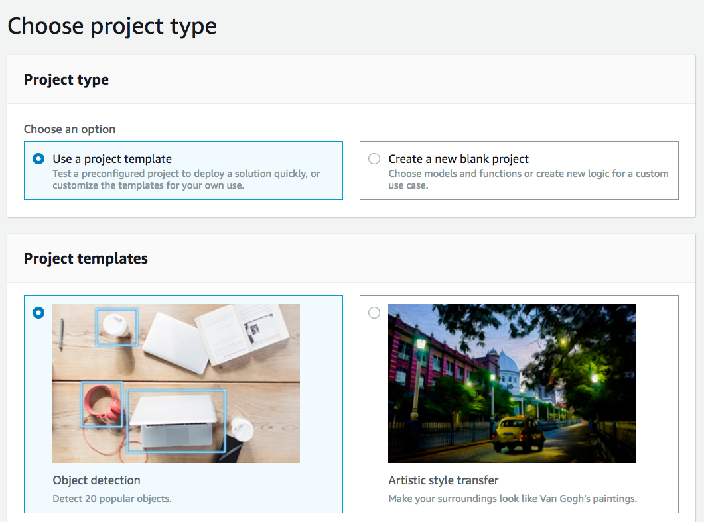

# conveyor-belt-deeplens
A smart conveyor-belt with AWS DeepLens and IoT

The Industrial IoT demo is a comprehensive demo that combines several AWS technologies to show the art of the possible in how AWS can play a central role in industrial design & automation, fleet management, predictive maintenance, and technician training. It features a 3D printed conveyor belt that is connected to AWS IoT.

This repository contains lab instruction to build a demo in your class to that will leverage AWS DeepLens camera to simulate communicate with the AWS IoT device shadow, control a virtual conveyor's stepper motor, and publish telemetry data.

There will be a physical version of this lab running on an actual conveyor-belt to showcase the interaction between the DeepLens camera, conveyor-bet device and IoT Cloud.

## Learning Objectives of the lab
In this lab you will be achieving the following:
- Create and deploy object detection project to DeepLens.
- View DeepLens camera inference output via AWS IoT Core.
- Create new DeepLens project to detect specific object and communicate with digital twin conveyor belt.
- Analyze results using IoT and CloudWatch.

## Table of Contents
1. [Architecture](#Architecture)
2. [LAB 1 - Create an *object-detection* project](#createmodel)
    - [Deploy your project](#deployproject)
    - [View your project output](#projectoutput)
3. [LAB 2 - Create Conveyor-belt Project](#conveyorbeltproject):

## Architecture
Lab Architecture

## Lab 1
1. Login into your AWS Lab account. Please consult the presenter's slide for detailed instructions:

2. Make sure you are using the N. Virginia region when you login into the console.

3. Go to the DeepLens service by searching "DeepLens" in the *find services* search menu

click on the name and the DeepLens service console page will open.

4. Make sure that there is a DeepLens device registered:

5. Click on the device name and make sure that it shows *online* before proceeding the rest of the lab. *NOTE*: if the device does not show online please notify the instructore.

### Create Your Project

1. Using your browser, open a **new tab** for AWS DeepLens console at https://console.aws.amazon.com/deeplens/.
2. Choose Projects, then choose Create new project.
3. On the Choose project type screen
- Choose Use a project template, then choose Object detection.

- Scroll to the bottom of the screen, then choose Next.
4. On the Specify project details screen
   - In the Project information section:
      - Either accept the default name for the project, or type a name you prefer.
      - Either accept the default description for the project, or type a description you prefer.

  - Choose Create.

This returns you to the Projects screen where the project you just created is listed with your other projects.

### Deploy your project 

Next you will deploy the Object Detection project you just created.

1. From Deeplens console, On the Projects screen, choose the radio button to the left of your project name, then choose Deploy to device.

2. On the Target device screen, from the list of AWS DeepLens devices, choose the radio button to the left of the device that you want to deploy this project to. An AWS DeepLens device can have only one project deployed to it at a time.

3. Choose Review.

   This will take you to the Review and deploy screen.

   If a project is already deployed to the device, you will see an error message
   "There is an existing project on this device. Do you want to replace it?
   If you Deploy, AWS DeepLens will remove the current project before deploying the new project."

   If you receive an error message stating "Cloud not find a project" please omit and proceed.

4. On the Review and deploy screen, review your project and choose Deploy to deploy the project.

   This will take you to to device screen, which shows the progress of your project deployment.

### View your project log messages in IoT:

You can also view the log messages that your project's Lambda function running on DeepLens device sends to IoT topic.

1. Once the deployment has been successful (Green message at the top), click on *Devices* the left menu.
2. Click on the name of your DeepLens device and on the next screen click on Copy button on the IoT topic under Project ouput.

3. On a new browser tap open the AWS IoT Console at https://console.aws.amazon.com/iot/home?region=us-east-1#/dashboard
4. Click on Test in the left navigation.
5. Paste the IoT topic in the textbox under Subscription topic and click Subscribe to topic
6. You should now see log messages published from DeepLens device to IoT.

### View your project video stream via your browser:

You can also view the project video stream via your local browser.
1. Make sure that you are connected to the Lab WiFi. Please ask ith the instructor to obtain the credentials.
2. You need to have Firefox browser on your local machine. IE is not supported for streaming video.
3. Request your device streaming certificate from the instructor. This certificate is unique for each device.
4. Once you have obtained your device's certificate
5. In Firefox: Choose Options (Preferences for older versions)
6. Choose Privacy & Security (Advanced for older versions)
7. Under Certificates, choose View Certificates
8. Under the Your Certificates tab, choose Import
9. Browse for the streaming certificate that you downloaded as part of registration

*NOTE*: For certificate password, type "DeepLens" and choose OK

You can observe the different types of object been recognized, labeled and confidence score with bounding boxes. The entire object detection abeling inference is happening on the device localy.

### Completion:
You have created and deployed object detection project to your Deeplens device.

## Lab 2

In this lab you will be creating a new project to detect a specific object with the DeepLens device and send an IoT message to the cloud to trigger an action: Stopping a digital twin conveyor belt running in a virtual scene (AWS Sumerian) and flash the object detected.

### Download the ML model and your desired Lambda function

1. On new tab, open the model folder in GitHub at https://github.com/linuxus/conveyor-belt-deeplens/tree/master/model, click on the file *conveyor-model.tar.gz* and download the model.

2. On new tab, open the functions folder in GitHub at https://github.com/linuxus/conveyor-belt-deeplens/tree/master/functions.
3. Choose the function that you need to use to detect the right object. For example if you'd like to detect a "car" with your DeepLens click on the *conveyor-object-detection-car.zip* file.
4. Then click on the download button.

### Create your inference lambda function
1. On new tab, open the AWS Lambda console at https://console.aws.amazon.com/lambda/.
2. Click on "Create function" button on top right corner.
3. Select "Author from scratch", provide a name: *conveyor-belt-car*, change the runtime option to *Python 2.7*
4. Under Permission, expand the "Choose or create an execution role" and select use existing role radio button.
5. Choose the role in the drop down option for *Existing role*

6. And click on "Create Function"
7. In the next screen update the function handler with *greengrassHelloWorld.lambda_handler*
7. Drop down the "Code entry type" and select "Upload a .zip file".

8. Click on the upload button and choose the .zip file you downloaded earlier step.
9. Click on "*Save*" button on the top right corner of the screen
10. Click on the "*Actions*" button menu and select publish a new version option from the drop down.

11. Click on "Publish" button:

### Import the ML model in your console
1. On new tab, open the Amazon S3 console at https://console.aws.amazon.com/s3/.
2. Create a new bucket called: *deeplens-demo#* where # is your demo ID number. For example deeplens-demo3 for lab3 user. *Note*: if the bucket already exist you do not need to re-create it.
3. Once the bucket is created click on it to open
4. Click on "Upload" button and upload the model that you've downloaded in previous step.
5. On new tab, open the AWS DeepLens console at https://console.aws.amazon.com/deeplens/.
6. Click on "Models" on the right navigation bar.
7. Click on "Import model" on the top right corner
8. On the Import model page:
    
    - type the location of the model in your S3 bucket
    - Give it a name: conveyor-belt
    - Select MXNet for the Model Framework
    - Optionally give a description and click on Import model

### Create Your Project

1. On new tab, open the AWS DeepLens console at https://console.aws.amazon.com/deeplens/.
2. Choose Projects, then choose Create new project.
3. On the Choose project type screen

* Choose Create a new blank project, and click Next.

4. On the Specify project details screen

    * Under Project information section:
        * Project name: conveyor-belt
    * Under Project content:
        * Click on Add model, click on radio button for conveyor-belt and click Add model.
        * Click on Add function, click on radio button for your lambda function (example: conveyor-belt-car) lambda function and click Add function.
* Click Create. This returns you to the Projects screen.
### Deploy DeepLens Project 

1. From DeepLens console, On the Projects screen, choose the radio button to the left of your project name, then choose Deploy to device.
2. On the Target device screen, from the list of AWS DeepLens devices, choose the radio button to the left of the device where you want to deploy this project.
3. Choose Review. This will take you to the Review and deploy screen.
    If a project is already deployed to the device, you will see a warning message "There is an existing project on this device. Do you want to replace it? If you Deploy, AWS DeepLens will remove the current project before deploying the new project."
4. On the Review and deploy screen, review your project and click Deploy to deploy the project. This will take you to to device screen, which shows the progress of your project deployment.
5. Make sure that the project deploys successfully.

### Create an IoT subscription for the inference lambda
This step is important because the Lambda function running on the DeepLens device needs to send IoT message to the device shadow. For security reason this is not enabled by default. You will need to create the subscription as per below:
1. On new tab, open the AWS DeepLens console at https://console.aws.amazon.com/iot/.
2. Click on Greengrass on the left nagivation bar and select the "Groups" sub-menu.
3. Click on the group icon in the middle pane
4. Click on Subscriptions and click on Add Subscriptions:

5. Select Lambdas for service and IoT Cloud for target:

6. Click next on the screen
7. configure the IoT topic with the following confiuration: *$aws/things/ConveyorSim/shadow/update* and click on next:

8. Click Next and finish
9. Now you need to deploy the configuration on the device. On the next page click on *Deployment*, then select *Actions* and click on *Deploy*
10. Wait until the deployment is successful.
